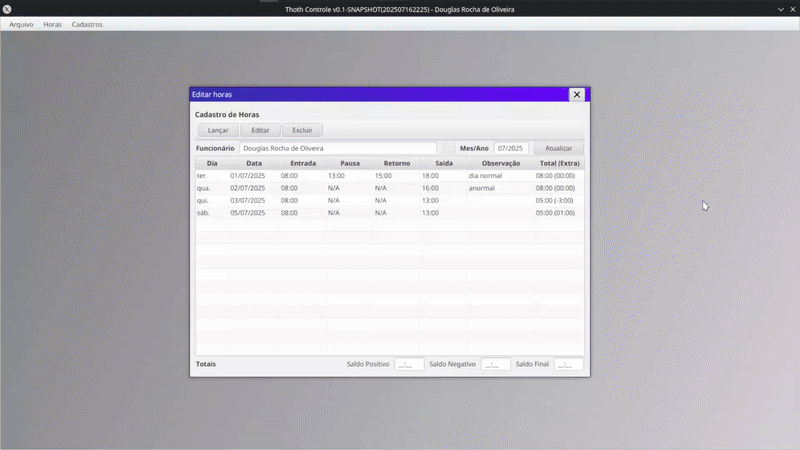

# NonaCept JavaFX Components

Some JavaFX components for making your life easier.
***
`nonacept.javafx.scene.layout.InternalWindow`: it's a component rather similar to `JInternalWindow` from Java Swing library.

It offers a JavaFX Node (in fact extends a Pane), and it can be added to another Parent, and have Content added to it. It will be shown as a Window inside your Window, it can be resized, moved, and etc.

### How to use
For this example, I will assume you already know a bit of JavaFX and have a `Pane` ready to be used as a "Desktop".

First things first, we will create a `InternalWindowManager`, this is a singleton object with a builder like creation:

```java
InternalWindowManager iwm = InternalWindowManager
        .create()
        .managing(contentPanel);
```
After this the object `iwm` can be used to manage the creation of `InternalWindow`.<br>
You have two methods to create `InternalWindow`, `createInternalWindow` and `createUniqueInternalWindow`.<br>
+ `createInternalWindow` - will create a `InternalWindow`that can have as many intances as the user opens it.<br>
+ `createUniqueInternalWindow` - will create a `InternalWindow`that is unique, if you try to create it again, the manager will simply focus this Window for you.<br>

Example:
```java
iwm.createUniqueInternalWindow("/example.fxml",
                mainStage, 
                ExampleController.class,
                customInitConsumer
                );
```
In this example, we'll have 4 parameters:<br>
+ `"/example.fxml"` - Is the location of the FXML file, this file will provide the content for the `InternalWindow`.<br>
+ `mainStage` - Can be `null`. This is the main `Stage` of your application, used if you want to interact with it within your Controller or `InternalWindow`.<br>
+ `ExampleController.class` - Represents the type of your FXML Controller, it has to implement `InternalWindowContent`.<br>
+ `customInitConsumer` - A custom `Consumer` receiving the type of your Controller, this will be executed if not null, can be used to run a custom initialization code for this controller.<br>

Optionaly, when creating your `InternalWindowManager` you can set a initialization code, using the interface `InternalWindowInitializer`, that will be used for all your `InternalWindow`.<br>
Example:
```java
InternalWindowInitializer<ExampleController> initializer = ((controller, stage, internalWindow) -> {
            controller.doSomething(stage);
            controller.alsoDoThis(internalWindow);
        });

InternalWindowManager imw = InternalWindowManager
        .create()
        .managing(contentPanel)
        .withInitializer(initializer);
```
You can also provide a class that implements `ChildListener`, when you want another class to also listen to `InternalWindow` open and close notifications.<br>
Example:
```java
InternalWindowManager imw = InternalWindowManager
        .create()
        .managing(contentPanel)
        .withListener(this);
```
Is also possible to set the theme used on all the `InternalWindow`:<br>
Example:
```java
InternalWindowManager imw = InternalWindowManager
        .create()
        .managing(contentPanel)
        .defaultTheme(InternalWindow.Theme.NONACEPT);
```
Right now, only two themes exist `JAVAFX` and `NONACEPT`, both can be found as a enumerator internal to `InternalWindow`<br>

Complete example:
```java
InternalWindowInitializer<ExampleController> initializer = ((controller, stage, internalWindow) -> {
            controller.doSomething(stage);
            controller.alsoDoThis(internalWindow);
        });

//creates a InternalWindowManager, that have all the options set
InternalWindowManager imw = InternalWindowManager
        .create()
        .managing(contentPanel)
        .withListener(this)
        .withInitializer(initializer)
        .defaultTheme(InternalWindow.Theme.NONACEPT);

//creates a unique window, focus on it if called again
iwm.createUniqueInternalWindow("/example.fxml",
                mainStage,
                ExampleController.class,
                customInitConsumer
                );
//creates a window, if called again, will open another window
iwm.createInternalWindow("/example.fxml",
                mainStage,
                customInitConsumer
                );

```

### Images
**Move**<br>
<br>
<br>
**Maximize**<br>
<br>
<br>
**Resize**<br>
